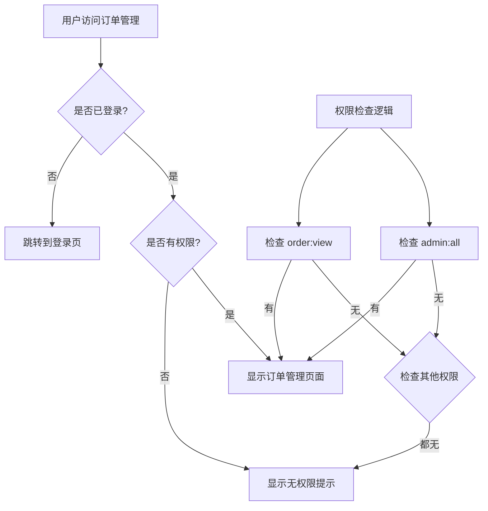

# 前端路由配置文档

## 📋 概述

本文档详细说明了练字机器人管理系统的前端路由配置，包括订单管理相关路由的完整实现。

## 🗂️ 路由结构

### 主要路由分组

```
/
├── /admin/login                    # 管理员登录
├── /admin/                         # 管理后台 (需要认证)
│   ├── dashboard                   # 数据看板
│   ├── content/                    # 内容管理
│   │   ├── products               # 产品管理
│   │   ├── charity                # 公益项目管理
│   │   ├── platforms              # 平台链接管理
│   │   └── news                   # 新闻管理
│   ├── business/                   # 业务管理
│   │   ├── sales                  # 销售数据
│   │   ├── rental-analytics       # 租赁数据分析
│   │   ├── customers              # 客户管理
│   │   └── orders                 # 订单管理 ⭐
│   ├── device/                     # 设备管理
│   │   ├── management             # 设备管理
│   │   ├── monitoring             # 设备监控
│   │   └── firmware               # 固件管理
│   └── system/                     # 系统管理
│       ├── courses                # 课程管理
│       ├── fonts                  # AI字体包管理
│       └── languages              # 多语言管理
├── /website/                       # 前台网站
│   ├── home                       # 首页
│   ├── products                   # 产品展示
│   ├── charity                    # 公益项目
│   ├── news/                      # 新闻中心
│   ├── support                    # 技术支持
│   └── contact                    # 联系我们
└── /test/                          # 测试页面
    ├── orders                     # 订单功能测试
    ├── simple-orders              # 简单订单测试
    ├── api                        # API测试
    ├── order-api                  # 订单API测试
    ├── route                      # 路由功能测试
    └── route-config               # 路由配置验证
```

## 🎯 订单管理路由详情

### 路由配置

```typescript
{
  path: 'business/orders',
  name: 'OrderManagement',
  component: lazyRoute(() => import('@/views/admin/business/OrderManagement.vue')),
  meta: { 
    title: '订单管理',
    requiresAuth: true,
    permissions: ['order:view', 'admin:all']
  }
}
```

### 路由元信息说明

| 属性 | 值 | 说明 |
|------|----|----|
| `path` | `'business/orders'` | 相对路径，完整路径为 `/admin/business/orders` |
| `name` | `'OrderManagement'` | 路由名称，用于编程式导航 |
| `component` | `OrderManagement.vue` | 懒加载的页面组件 |
| `title` | `'订单管理'` | 页面标题，用于面包屑和浏览器标题 |
| `requiresAuth` | `true` | 需要用户认证才能访问 |
| `permissions` | `['order:view', 'admin:all']` | 所需权限，满足任一即可访问 |

## 🔐 权限控制

### 权限定义

```typescript
// 订单相关权限
'order:view'              // 查看订单
'business:order:manage'   // 管理订单
'business:manage'         // 业务管理
'admin:all'              // 超级管理员
```

### 权限检查流程



## 🧭 导航菜单配置

### 菜单结构

```typescript
{
  path: '/admin/business',
  title: '业务管理',
  icon: ShoppingCart,
  category: 'main',
  children: [
    { 
      path: '/admin/business/sales', 
      title: '销售数据', 
      icon: DataAnalysis 
    },
    { 
      path: '/admin/business/rental-analytics', 
      title: '租赁数据分析', 
      icon: Monitor 
    },
    { 
      path: '/admin/business/customers', 
      title: '客户管理', 
      icon: User 
    },
    { 
      path: '/admin/business/orders', 
      title: '订单管理', 
      icon: Document 
    }
  ]
}
```

### 菜单权限过滤

```typescript
// 根据用户权限过滤菜单项
const menuItems = computed(() => {
  return permissionService.getAccessibleMenuItems(originalMenuItems)
})
```

## 🍞 面包屑导航

### 面包屑生成规则

```typescript
// 订单管理页面面包屑
控制台 > 业务管理 > 订单管理

// 面包屑数据结构
{
  parent: '业务管理',
  current: '订单管理'
}
```

### 面包屑组件使用

```vue
<template>
  <BreadcrumbNav 
    title="订单管理"
    description="管理销售订单和租赁订单，跟踪订单状态"
  />
</template>
```

## 🛡️ 路由守卫

### 全局前置守卫

```typescript
router.beforeEach((to, from, next) => {
  // 1. 新闻路由权限检查
  if (to.path.includes('/news')) {
    newsRouteGuard(to, from, next)
    return
  }
  
  // 2. 认证检查
  if (to.meta.requiresAuth) {
    const token = localStorage.getItem('token')
    const userInfo = localStorage.getItem('userInfo')
    
    if (!token || !userInfo) {
      next('/admin/login')
      return
    }
    
    // 权限验证
    try {
      const user = JSON.parse(userInfo)
      if (!user.permissions?.includes('admin:all')) {
        next('/admin/login')
        return
      }
    } catch (error) {
      next('/admin/login')
      return
    }
  }
  
  // 3. 已登录用户访问登录页重定向
  if (to.path === '/admin/login') {
    const token = localStorage.getItem('token')
    if (token) {
      next('/admin/dashboard')
      return
    }
  }
  
  // 4. 设置页面标题
  if (to.meta.title) {
    document.title = `${to.meta.title} - 练字机器人管理后台`
  }
  
  next()
})
```

## 🧪 测试路由

### 测试页面列表

| 路径 | 名称 | 功能 |
|------|------|------|
| `/test/orders` | 订单功能测试 | 测试订单管理页面功能 |
| `/test/simple-orders` | 简单订单测试 | 简化的订单测试页面 |
| `/test/api` | API测试 | 通用API测试工具 |
| `/test/order-api` | 订单API测试 | 专门测试订单API |
| `/test/route` | 路由功能测试 | 测试路由跳转和权限 |
| `/test/route-config` | 路由配置验证 | 验证路由配置正确性 |

### 测试页面特性

- 🔧 **功能测试** - 测试各种路由功能
- 📊 **配置验证** - 验证路由配置正确性
- 🔍 **问题诊断** - 帮助发现路由问题
- 📝 **使用示例** - 提供路由使用示例

## 🔧 工具和组件

### 路由验证工具

```typescript
// 使用路由验证器
import { routeValidator } from '@/utils/routeValidator'

const result = routeValidator.validateRoutes(routes)
console.log('验证结果:', result)
```

### 面包屑导航组件

```vue
<!-- 基础使用 -->
<BreadcrumbNav />

<!-- 自定义标题和描述 -->
<BreadcrumbNav 
  title="自定义标题"
  description="自定义描述"
/>

<!-- 自定义面包屑 -->
<BreadcrumbNav 
  :customBreadcrumb="{ parent: '自定义父级', current: '当前页面' }"
/>
```

### 懒加载工具

```typescript
// lazyRoute 工具函数
import { lazyRoute } from '@/utils/lazyLoading'

// 使用懒加载
component: lazyRoute(() => import('@/views/admin/business/OrderManagement.vue'))
```

## 📱 响应式路由

### 移动端适配

```typescript
// 移动端菜单控制
const mobileMenuOpen = ref(false)

const toggleMobileMenu = () => {
  mobileMenuOpen.value = !mobileMenuOpen.value
}
```

### 响应式样式

```scss
// 移动端路由样式
@media (max-width: 768px) {
  .sidebar {
    transform: translateX(-100%);
    
    &.mobile-open {
      transform: translateX(0);
    }
  }
  
  .main-content {
    margin-left: 0;
  }
}
```

## 🚀 性能优化

### 懒加载策略

```typescript
// 组件懒加载
const OrderManagement = () => import('@/views/admin/business/OrderManagement.vue')

// 路由级别的代码分割
component: lazyRoute(() => import('@/views/admin/business/OrderManagement.vue'))
```

### 预加载配置

```typescript
// 预加载关键路由
router.beforeEach((to, from, next) => {
  // 预加载常用页面
  if (to.path === '/admin/dashboard') {
    import('@/views/admin/business/OrderManagement.vue')
  }
  next()
})
```

## 🔍 调试和监控

### 路由调试

```typescript
// 开发环境路由调试
if (process.env.NODE_ENV === 'development') {
  router.beforeEach((to, from, next) => {
    console.log('路由跳转:', from.path, '->', to.path)
    next()
  })
}
```

### 性能监控

```typescript
// 路由性能监控
router.beforeEach((to, from, next) => {
  const startTime = Date.now()
  
  router.afterEach(() => {
    const loadTime = Date.now() - startTime
    console.log(`页面加载时间: ${loadTime}ms`)
  })
  
  next()
})
```

## 📚 最佳实践

### 路由命名规范

- 使用 PascalCase 命名路由：`OrderManagement`
- 路径使用 kebab-case：`business/orders`
- 组件文件名与路由名保持一致

### 权限配置规范

- 明确定义权限层级：`模块:操作`
- 提供超级管理员权限：`admin:all`
- 权限检查使用"或"逻辑，满足任一即可

### 元信息配置规范

- 必须设置 `title` 用于页面标题
- 需要认证的页面设置 `requiresAuth: true`
- 需要权限的页面设置 `permissions` 数组

## 🔧 故障排除

### 常见问题

1. **路由无法访问**
   - 检查权限配置
   - 验证用户登录状态
   - 确认路由路径正确

2. **面包屑显示错误**
   - 检查路由元信息配置
   - 验证菜单项配置
   - 确认路径匹配规则

3. **页面刷新后状态丢失**
   - 检查localStorage存储
   - 验证路由守卫逻辑
   - 确认状态持久化

### 调试工具

- 使用 `/test/route-config` 验证路由配置
- 使用 `/test/route` 测试路由功能
- 查看浏览器控制台的路由日志

---

**文档版本**: v1.0  
**最后更新**: 2025-01-28  
**维护者**: 开发团队