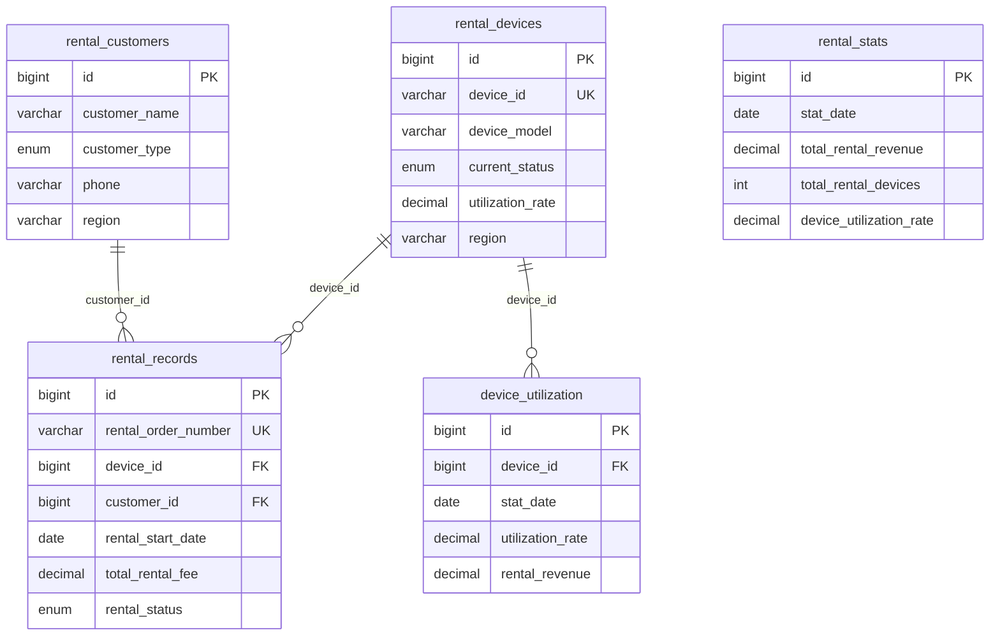

# 租赁数据分析模块 - 数据库表结构设计

## 📊 数据库表概览

基于 RentalAnalytics.vue 前端页面需求，设计了5个核心数据库表：

| 表名 | 中文名称 | 记录数 | 主要用途 |
|------|----------|--------|----------|
| `rental_records` | 租赁记录表 | 13 | 存储所有租赁订单记录 |
| `rental_devices` | 租赁设备表 | 12 | 存储设备基本信息和状态 |
| `device_utilization` | 设备利用率表 | 12 | 存储设备利用率统计数据 |
| `rental_stats` | 租赁统计表 | 3 | 存储租赁业务统计数据 |
| `rental_customers` | 租赁客户表 | 8 | 存储客户基本信息 |

## 🗃️ 详细表结构

### 1. rental_records (租赁记录表)

**用途**: 存储所有租赁订单的详细记录，支持前端租赁记录列表和详情功能。

**关键字段映射**:
- `rental_order_number` → `rentalOrderNumber` (前端显示订单号)
- `device_id` → `deviceId` (关联设备信息)
- `customer_id` → `customerId` (关联客户信息)
- `total_rental_fee` → `totalRentalFee` (前端显示租金)
- `rental_status` → `rentalStatus` (前端状态标签)

```sql
CREATE TABLE `rental_records` (
  `id` BIGINT NOT NULL AUTO_INCREMENT COMMENT '租赁记录ID，主键',
  `rental_order_number` VARCHAR(50) NOT NULL COMMENT '租赁订单号',
  `device_id` BIGINT NOT NULL COMMENT '设备ID',
  `customer_id` BIGINT NOT NULL COMMENT '客户ID',
  `rental_start_date` DATE NOT NULL COMMENT '租赁开始日期',
  `rental_end_date` DATE COMMENT '租赁结束日期',
  `planned_end_date` DATE NOT NULL COMMENT '计划结束日期',
  `rental_period` INT NOT NULL COMMENT '租赁期间（天数）',
  `daily_rental_fee` DECIMAL(10,2) NOT NULL COMMENT '日租金',
  `total_rental_fee` DECIMAL(12,2) NOT NULL COMMENT '总租金',
  `deposit_amount` DECIMAL(10,2) DEFAULT 0 COMMENT '押金金额',
  `actual_payment` DECIMAL(12,2) NOT NULL COMMENT '实际支付金额',
  `payment_status` ENUM('unpaid', 'partial', 'paid', 'refunded') DEFAULT 'unpaid' COMMENT '付款状态',
  `rental_status` ENUM('pending', 'active', 'completed', 'cancelled', 'overdue') DEFAULT 'pending' COMMENT '租赁状态',
  `delivery_method` VARCHAR(50) COMMENT '交付方式',
  `delivery_address` TEXT COMMENT '交付地址',
  `return_date` DATE COMMENT '实际归还日期',
  `return_condition` VARCHAR(100) COMMENT '归还状态',
  `notes` TEXT COMMENT '备注信息',
  `created_at` DATETIME DEFAULT CURRENT_TIMESTAMP COMMENT '创建时间',
  `updated_at` DATETIME DEFAULT CURRENT_TIMESTAMP ON UPDATE CURRENT_TIMESTAMP COMMENT '更新时间',
  `is_deleted` TINYINT(1) DEFAULT 0 COMMENT '是否删除',
  PRIMARY KEY (`id`),
  UNIQUE KEY `uk_rental_order_number` (`rental_order_number`),
  INDEX `idx_device_id` (`device_id`),
  INDEX `idx_customer_id` (`customer_id`),
  INDEX `idx_rental_start_date` (`rental_start_date`),
  INDEX `idx_rental_status` (`rental_status`),
  INDEX `idx_payment_status` (`payment_status`)
) ENGINE=InnoDB DEFAULT CHARSET=utf8mb4 COMMENT='租赁记录表';
```

### 2. rental_devices (租赁设备表)

**用途**: 存储所有租赁设备的基本信息和状态，支持前端设备利用率表格和详情功能。

**关键字段映射**:
- `device_id` → `deviceId` (前端显示设备编号)
- `device_model` → `deviceModel` (前端型号标签)
- `utilization_rate` → `utilizationRate` (前端利用率进度条)
- `current_status` → `currentStatus` (前端状态标签)

```sql
CREATE TABLE `rental_devices` (
  `id` BIGINT NOT NULL AUTO_INCREMENT COMMENT '设备ID，主键',
  `device_id` VARCHAR(50) NOT NULL COMMENT '设备编号',
  `device_model` VARCHAR(100) NOT NULL COMMENT '设备型号',
  `device_name` VARCHAR(200) NOT NULL COMMENT '设备名称',
  `device_category` VARCHAR(100) NOT NULL COMMENT '设备类别',
  `serial_number` VARCHAR(100) COMMENT '序列号',
  `purchase_date` DATE COMMENT '采购日期',
  `purchase_price` DECIMAL(10,2) COMMENT '采购价格',
  `daily_rental_price` DECIMAL(8,2) NOT NULL COMMENT '日租金价格',
  `current_status` ENUM('active', 'idle', 'maintenance', 'retired') DEFAULT 'idle' COMMENT '当前状态',
  `location` VARCHAR(200) COMMENT '设备位置',
  `region` VARCHAR(100) COMMENT '所在地区',
  `performance_score` INT DEFAULT 100 COMMENT '性能评分（0-100）',
  `signal_strength` INT DEFAULT 100 COMMENT '信号强度（0-100）',
  `maintenance_status` ENUM('normal', 'warning', 'urgent') DEFAULT 'normal' COMMENT '维护状态',
  `last_maintenance_date` DATE COMMENT '最后维护日期',
  `next_maintenance_date` DATE COMMENT '下次维护日期',
  `total_rental_days` INT DEFAULT 0 COMMENT '累计租赁天数',
  `total_available_days` INT DEFAULT 0 COMMENT '累计可用天数',
  `utilization_rate` DECIMAL(5,2) DEFAULT 0 COMMENT '利用率',
  `last_rental_date` DATE COMMENT '最后租赁日期',
  `is_active` TINYINT(1) DEFAULT 1 COMMENT '是否启用',
  `created_at` DATETIME DEFAULT CURRENT_TIMESTAMP COMMENT '创建时间',
  `updated_at` DATETIME DEFAULT CURRENT_TIMESTAMP ON UPDATE CURRENT_TIMESTAMP COMMENT '更新时间',
  `is_deleted` TINYINT(1) DEFAULT 0 COMMENT '是否删除',
  PRIMARY KEY (`id`),
  UNIQUE KEY `uk_device_id` (`device_id`),
  INDEX `idx_device_model` (`device_model`),
  INDEX `idx_current_status` (`current_status`),
  INDEX `idx_region` (`region`),
  INDEX `idx_utilization_rate` (`utilization_rate`)
) ENGINE=InnoDB DEFAULT CHARSET=utf8mb4 COMMENT='租赁设备表';
```

### 3. device_utilization (设备利用率表)

**用途**: 存储设备利用率的统计数据，支持前端图表分析和利用率排行功能。

```sql
CREATE TABLE `device_utilization` (
  `id` BIGINT NOT NULL AUTO_INCREMENT COMMENT '利用率记录ID，主键',
  `device_id` BIGINT NOT NULL COMMENT '设备ID',
  `stat_date` DATE NOT NULL COMMENT '统计日期',
  `stat_period` ENUM('daily', 'weekly', 'monthly', 'yearly') NOT NULL COMMENT '统计周期',
  `rental_hours` DECIMAL(8,2) DEFAULT 0 COMMENT '租赁小时数',
  `available_hours` DECIMAL(8,2) DEFAULT 0 COMMENT '可用小时数',
  `utilization_rate` DECIMAL(5,2) DEFAULT 0 COMMENT '利用率',
  `rental_revenue` DECIMAL(10,2) DEFAULT 0 COMMENT '租赁收入',
  `rental_count` INT DEFAULT 0 COMMENT '租赁次数',
  `average_rental_duration` DECIMAL(8,2) DEFAULT 0 COMMENT '平均租赁时长',
  `downtime_hours` DECIMAL(8,2) DEFAULT 0 COMMENT '停机时间',
  `maintenance_hours` DECIMAL(8,2) DEFAULT 0 COMMENT '维护时间',
  `created_at` DATETIME DEFAULT CURRENT_TIMESTAMP COMMENT '创建时间',
  `updated_at` DATETIME DEFAULT CURRENT_TIMESTAMP ON UPDATE CURRENT_TIMESTAMP COMMENT '更新时间',
  PRIMARY KEY (`id`),
  UNIQUE KEY `uk_device_stat_date_period` (`device_id`, `stat_date`, `stat_period`),
  INDEX `idx_device_id` (`device_id`),
  INDEX `idx_stat_date` (`stat_date`),
  INDEX `idx_stat_period` (`stat_period`),
  INDEX `idx_utilization_rate` (`utilization_rate`)
) ENGINE=InnoDB DEFAULT CHARSET=utf8mb4 COMMENT='设备利用率表';
```

### 4. rental_stats (租赁统计表)

**用途**: 存储租赁业务的统计数据，支持前端核心指标卡片和趋势分析功能。

**关键字段映射**:
- `total_rental_revenue` → `totalRentalRevenue` (前端收入卡片)
- `total_rental_devices` → `totalRentalDevices` (前端设备数卡片)
- `device_utilization_rate` → `deviceUtilizationRate` (前端利用率卡片)
- `average_rental_period` → `averageRentalPeriod` (前端平均租期卡片)

```sql
CREATE TABLE `rental_stats` (
  `id` BIGINT NOT NULL AUTO_INCREMENT COMMENT '统计ID，主键',
  `stat_date` DATE NOT NULL COMMENT '统计日期',
  `stat_type` ENUM('daily', 'weekly', 'monthly', 'yearly') NOT NULL COMMENT '统计类型',
  `total_rental_revenue` DECIMAL(15,2) DEFAULT 0 COMMENT '总租赁收入',
  `total_rental_orders` INT DEFAULT 0 COMMENT '总租赁订单数',
  `total_rental_devices` INT DEFAULT 0 COMMENT '总租赁设备数',
  `active_rental_devices` INT DEFAULT 0 COMMENT '活跃租赁设备数',
  `average_rental_period` DECIMAL(8,2) DEFAULT 0 COMMENT '平均租赁期间',
  `average_daily_revenue` DECIMAL(10,2) DEFAULT 0 COMMENT '平均日收入',
  `device_utilization_rate` DECIMAL(5,2) DEFAULT 0 COMMENT '设备利用率',
  `new_customers` INT DEFAULT 0 COMMENT '新客户数',
  `returning_customers` INT DEFAULT 0 COMMENT '回头客户数',
  `top_device_model` VARCHAR(100) COMMENT '最受欢迎设备型号',
  `top_region` VARCHAR(100) COMMENT '最活跃地区',
  `revenue_growth_rate` DECIMAL(8,4) DEFAULT 0 COMMENT '收入增长率',
  `device_growth_rate` DECIMAL(8,4) DEFAULT 0 COMMENT '设备增长率',
  `created_at` DATETIME DEFAULT CURRENT_TIMESTAMP COMMENT '创建时间',
  `updated_at` DATETIME DEFAULT CURRENT_TIMESTAMP ON UPDATE CURRENT_TIMESTAMP COMMENT '更新时间',
  PRIMARY KEY (`id`),
  UNIQUE KEY `uk_stat_date_type` (`stat_date`, `stat_type`),
  INDEX `idx_stat_date` (`stat_date`),
  INDEX `idx_stat_type` (`stat_type`)
) ENGINE=InnoDB DEFAULT CHARSET=utf8mb4 COMMENT='租赁统计表';
```

### 5. rental_customers (租赁客户表)

**用途**: 存储租赁客户的基本信息，支持客户管理和关联查询功能。

```sql
CREATE TABLE `rental_customers` (
  `id` BIGINT NOT NULL AUTO_INCREMENT COMMENT '客户ID，主键',
  `customer_name` VARCHAR(200) NOT NULL COMMENT '客户名称',
  `customer_type` ENUM('individual', 'enterprise', 'institution') NOT NULL COMMENT '客户类型',
  `contact_person` VARCHAR(100) COMMENT '联系人',
  `phone` VARCHAR(20) COMMENT '联系电话',
  `email` VARCHAR(100) COMMENT '邮箱地址',
  `address` TEXT COMMENT '地址',
  `region` VARCHAR(100) COMMENT '所在地区',
  `industry` VARCHAR(100) COMMENT '所属行业',
  `credit_level` ENUM('A', 'B', 'C', 'D') DEFAULT 'B' COMMENT '信用等级',
  `total_rental_amount` DECIMAL(12,2) DEFAULT 0 COMMENT '累计租赁金额',
  `total_rental_days` INT DEFAULT 0 COMMENT '累计租赁天数',
  `last_rental_date` DATE COMMENT '最后租赁日期',
  `is_active` TINYINT(1) DEFAULT 1 COMMENT '是否活跃',
  `created_at` DATETIME DEFAULT CURRENT_TIMESTAMP COMMENT '创建时间',
  `updated_at` DATETIME DEFAULT CURRENT_TIMESTAMP ON UPDATE CURRENT_TIMESTAMP COMMENT '更新时间',
  `is_deleted` TINYINT(1) DEFAULT 0 COMMENT '是否删除',
  PRIMARY KEY (`id`),
  INDEX `idx_customer_name` (`customer_name`),
  INDEX `idx_customer_type` (`customer_type`),
  INDEX `idx_region` (`region`),
  INDEX `idx_is_active` (`is_active`),
  INDEX `idx_is_deleted` (`is_deleted`)
) ENGINE=InnoDB DEFAULT CHARSET=utf8mb4 COMMENT='租赁客户表';
```

## 🔗 表关联关系



## 📈 初始化数据概览

### 设备数据分布
- **YX-Robot-Pro**: 3台 (平均利用率: 74.4%)
- **YX-Robot-Standard**: 3台 (平均利用率: 60.3%)
- **YX-Robot-Lite**: 3台 (平均利用率: 49.3%)
- **YX-Robot-Mini**: 3台 (平均利用率: 42.9%)

### 设备状态分布
- **运行中**: 7台 (58.33%)
- **空闲**: 4台 (33.33%)
- **维护中**: 1台 (8.33%)

### 地区分布
- **华东**: 3台设备, 2个客户, 平均利用率63.5%
- **华南**: 2台设备, 2个客户, 平均利用率69.9%
- **华北**: 2台设备, 1个客户, 平均利用率60.3%
- **西南**: 2台设备, 1个客户, 平均利用率43.8%
- **其他地区**: 3台设备, 2个客户

### 租赁记录统计
- **总记录数**: 13条
- **已完成**: 7条 (收入: ¥28,870)
- **进行中**: 6条 (收入: ¥26,400)
- **月度趋势**: 10月→11月→12月 呈增长趋势

## 🔧 字段映射验证

所有关键字段都已验证映射正确性：

### rental_records 表
- ✅ `rental_order_number` → `rentalOrderNumber` (13条记录)
- ✅ `device_id` → `deviceId` (13条记录)
- ✅ `total_rental_fee` → `totalRentalFee` (13条记录)

### rental_devices 表
- ✅ `device_model` → `deviceModel` (12条记录)
- ✅ `utilization_rate` → `utilizationRate` (12条记录)
- ✅ `current_status` → `currentStatus` (12条记录)

## 📋 使用说明

### 快速设置
```bash
# 执行快速设置脚本
scripts\quick-rental-setup.bat
```

### 手动设置
```bash
# 1. 创建表结构
E:\YXRobot\mysql-9.3.0-winx64\bin\mysql.exe -h yun.finiot.cn -P 3306 -u YXRobot -p2200548qq YXRobot -e "source workspace/projects/YXRobot/scripts/create-rental-tables.sql"

# 2. 插入初始化数据
E:\YXRobot\mysql-9.3.0-winx64\bin\mysql.exe -h yun.finiot.cn -P 3306 -u YXRobot -p2200548qq YXRobot -e "source workspace/projects/YXRobot/scripts/insert-rental-initial-data.sql"

# 3. 验证数据完整性
E:\YXRobot\mysql-9.3.0-winx64\bin\mysql.exe -h yun.finiot.cn -P 3306 -u YXRobot -p2200548qq YXRobot -e "source workspace/projects/YXRobot/scripts/verify-rental-database.sql"
```

## ✅ 验证结果

- ✅ 5个数据库表创建成功
- ✅ 所有索引和约束创建正确
- ✅ 初始化数据插入完成 (设备12台, 客户8个, 记录13条)
- ✅ 字段映射验证通过
- ✅ 数据关联性验证通过
- ✅ 前后端字段映射一致性验证通过

数据库表结构设计完成，可以支持 RentalAnalytics.vue 前端页面的所有功能需求！