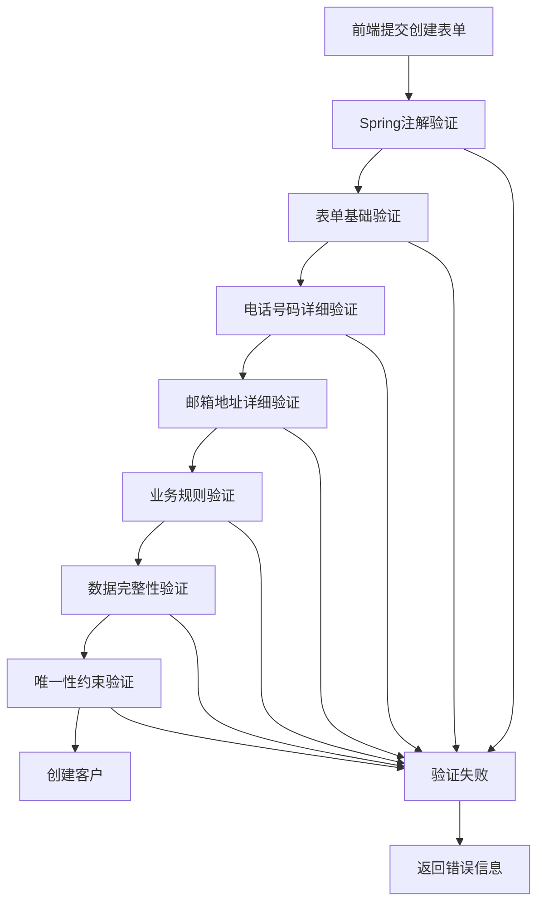
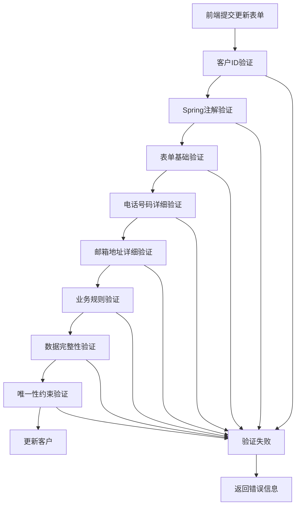

# 客户管理模块数据验证和异常处理系统文档

## 概述

本文档描述了客户管理模块的完整数据验证和异常处理系统，该系统确保客户数据的完整性、一致性和安全性。

## 系统架构

### 验证层次结构

```
前端表单验证
    ↓
Spring Validation注解验证
    ↓
自定义验证器验证
    ↓
业务规则验证
    ↓
数据完整性验证
    ↓
数据库约束验证
```

## 核心组件

### 1. 异常处理组件

#### CustomerException
- **位置**: `com.yxrobot.exception.CustomerException`
- **功能**: 客户管理模块的基础异常类
- **特性**:
  - 支持错误代码和错误数据
  - 提供多种预定义异常类型
  - 支持异常链传递

#### CustomerExceptionHandler
- **位置**: `com.yxrobot.exception.CustomerExceptionHandler`
- **功能**: 全局异常处理器
- **特性**:
  - 统一的错误响应格式
  - 详细的错误日志记录
  - 友好的错误信息返回

### 2. 验证器组件

#### CustomerValidator
- **位置**: `com.yxrobot.validation.CustomerValidator`
- **功能**: 客户实体数据验证
- **验证内容**:
  - 必填字段验证
  - 字段格式验证
  - 业务规则验证

#### CustomerFormValidator
- **位置**: `com.yxrobot.validation.CustomerFormValidator`
- **功能**: 表单数据验证
- **特性**:
  - 支持创建和更新表单验证
  - 详细的验证结果反馈
  - 敏感词检查

#### PhoneNumberValidator
- **位置**: `com.yxrobot.validation.PhoneNumberValidator`
- **功能**: 电话号码专业验证
- **特性**:
  - 运营商识别
  - 虚拟号码检测
  - 测试号码识别
  - 区号城市映射

#### EmailValidator
- **位置**: `com.yxrobot.validation.EmailValidator`
- **功能**: 邮箱地址专业验证
- **特性**:
  - 邮箱类型识别
  - 临时邮箱检测
  - 教育邮箱识别
  - 域名可信度检查

#### DataIntegrityValidator
- **位置**: `com.yxrobot.validation.DataIntegrityValidator`
- **功能**: 数据完整性验证
- **特性**:
  - 数据一致性检查
  - 关联数据验证
  - 唯一性约束验证
  - 批量数据验证

### 3. 服务组件

#### CustomerValidationService
- **位置**: `com.yxrobot.service.CustomerValidationService`
- **功能**: 验证服务协调器
- **特性**:
  - 统一的验证接口
  - 综合验证结果汇总
  - 验证流程编排

### 4. 配置组件

#### ValidationConfig
- **位置**: `com.yxrobot.config.ValidationConfig`
- **功能**: 验证配置管理
- **配置项**:
  - 字段长度限制
  - 业务规则参数
  - 验证开关控制
  - 敏感词列表

### 5. 工具组件

#### ValidationUtils
- **位置**: `com.yxrobot.validation.ValidationUtils`
- **功能**: 验证工具类
- **特性**:
  - 通用验证方法
  - 数据格式化工具
  - 敏感信息掩码

## 验证流程

### 客户创建验证流程



### 客户更新验证流程



## 验证规则详解

### 1. 基础字段验证

#### 客户姓名
- **必填**: 是
- **长度**: 2-50个字符
- **格式**: 中文、英文、数字、空格、中点
- **敏感词**: 检查并拒绝

#### 联系电话
- **必填**: 是
- **格式**: 11位手机号码
- **运营商**: 识别并提示
- **虚拟号码**: 可配置是否允许
- **测试号码**: 可配置是否允许

#### 邮箱地址
- **必填**: 否
- **格式**: 标准邮箱格式
- **长度**: 最大100个字符
- **临时邮箱**: 可配置是否允许
- **可信域名**: 可配置是否要求

#### 公司名称
- **必填**: 否
- **长度**: 最大100个字符
- **格式**: 中文、英文、数字、特殊符号

#### 备注信息
- **必填**: 否
- **长度**: 最大500个字符
- **敏感词**: 检查并拒绝

### 2. 业务规则验证

#### 客户等级
- **REGULAR**: 普通客户
- **VIP**: VIP客户（消费≥10000元）
- **PREMIUM**: 高级客户（消费≥50000元）

#### 客户状态
- **ACTIVE**: 活跃客户
- **INACTIVE**: 不活跃客户
- **SUSPENDED**: 暂停客户
- **DELETED**: 已删除客户

#### 客户价值评分
- **范围**: 0-10分
- **精度**: 小数点后1位
- **一致性**: 与消费金额匹配

### 3. 数据完整性验证

#### 时间一致性
- 更新时间 ≥ 创建时间
- 最后活跃时间 ≥ 创建时间
- 注册时间 ≤ 创建时间

#### 数值一致性
- 累计消费金额 ≥ 0
- 客户价值评分 0-10
- 设备总数 = 购买设备数 + 租赁设备数

#### 状态一致性
- 活跃客户：90天内有活动
- 不活跃客户：30天以上无活动
- 等级与消费金额匹配

### 4. 唯一性约束验证

#### 客户姓名
- 系统内唯一
- 更新时排除自身

#### 联系电话
- 系统内唯一
- 更新时排除自身

#### 邮箱地址
- 系统内唯一（如果提供）
- 更新时排除自身

## 错误处理机制

### 错误分类

#### 1. 验证错误（400）
- 字段格式错误
- 必填字段缺失
- 业务规则违反
- 数据完整性错误

#### 2. 业务错误（400-409）
- 客户不存在（404）
- 客户已存在（409）
- 操作不允许（405）
- 权限不足（403）

#### 3. 系统错误（500）
- 数据库连接错误
- 服务调用失败
- 系统内部错误

### 错误响应格式

```json
{
  "code": 400,
  "errorCode": "VALIDATION_ERROR",
  "message": "数据验证失败",
  "data": null,
  "errors": [
    {
      "category": "FORM",
      "field": "name",
      "message": "客户姓名不能为空"
    }
  ],
  "warnings": [
    {
      "category": "PHONE",
      "field": "phone",
      "message": "检测到虚拟运营商号码"
    }
  ],
  "timestamp": "2025-01-01T12:00:00",
  "path": "/api/admin/customers"
}
```

## 配置说明

### 验证配置文件
- **位置**: `application-validation.yml`
- **作用**: 集中管理验证参数
- **热更新**: 支持运行时配置更新

### 主要配置项

#### 字段限制配置
```yaml
field-limits:
  min-name-length: 2
  max-name-length: 50
  max-company-length: 100
  max-notes-length: 500
```

#### 业务规则配置
```yaml
business-rules:
  vip-threshold: 10000
  premium-threshold: 50000
  max-customer-value: 10
  inactive-threshold-days: 90
```

#### 验证开关配置
```yaml
switches:
  enable-strict-validation: true
  enable-sensitive-word-check: true
  enable-phone-carrier-check: true
  enable-temporary-email-check: true
```

## 性能优化

### 验证缓存
- 运营商信息缓存
- 邮箱域名缓存
- 敏感词缓存

### 批量验证
- 支持批量数据验证
- 并行验证处理
- 结果聚合优化

### 异步验证
- 非关键验证异步执行
- 验证结果异步通知
- 性能监控统计

## 监控和日志

### 验证日志
- 验证失败详细记录
- 验证性能统计
- 异常堆栈跟踪

### 监控指标
- 验证成功率
- 验证响应时间
- 错误类型分布

### 告警机制
- 验证失败率告警
- 系统异常告警
- 性能阈值告警

## 测试策略

### 单元测试
- 各验证器独立测试
- 边界条件测试
- 异常情况测试

### 集成测试
- 验证流程端到端测试
- 多验证器协作测试
- 配置变更影响测试

### 性能测试
- 大数据量验证测试
- 并发验证测试
- 内存使用测试

## 最佳实践

### 开发规范
1. 验证器职责单一
2. 错误信息友好明确
3. 配置参数外部化
4. 日志记录详细完整

### 使用建议
1. 优先使用注解验证
2. 复杂验证使用自定义验证器
3. 批量操作使用批量验证
4. 关键验证添加监控

### 扩展指南
1. 新增验证器继承基础接口
2. 新增异常类型继承基础异常
3. 新增配置项遵循命名规范
4. 新增功能添加对应测试

## 故障排查

### 常见问题

#### 验证失败
1. 检查字段格式是否正确
2. 确认业务规则配置
3. 验证数据完整性
4. 检查唯一性约束

#### 性能问题
1. 检查验证器执行时间
2. 优化数据库查询
3. 调整缓存策略
4. 考虑异步处理

#### 配置问题
1. 确认配置文件加载
2. 检查配置项格式
3. 验证配置生效
4. 重启服务应用

### 调试工具
- 验证日志分析
- 性能监控面板
- 配置管理界面
- 测试验证工具

## 版本历史

### v1.0.0 (2025-01-01)
- 初始版本发布
- 基础验证功能
- 异常处理机制
- 配置管理系统

### 后续规划
- 验证规则可视化配置
- 机器学习异常检测
- 实时验证性能优化
- 多语言错误信息支持